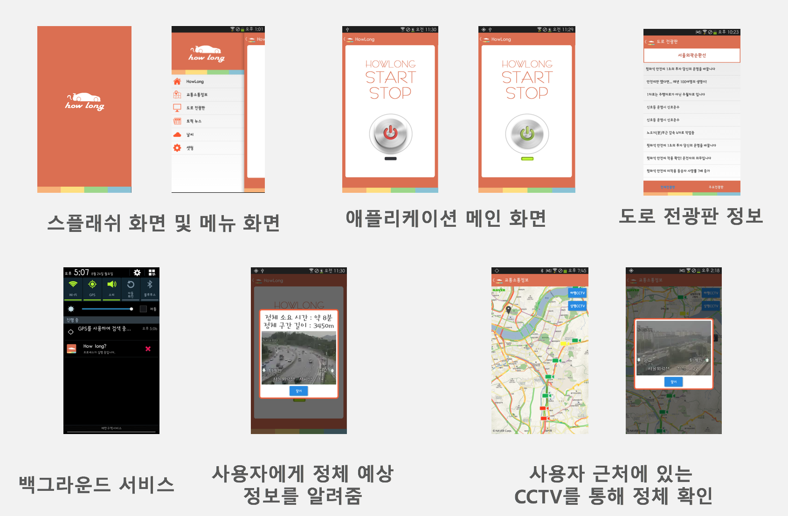
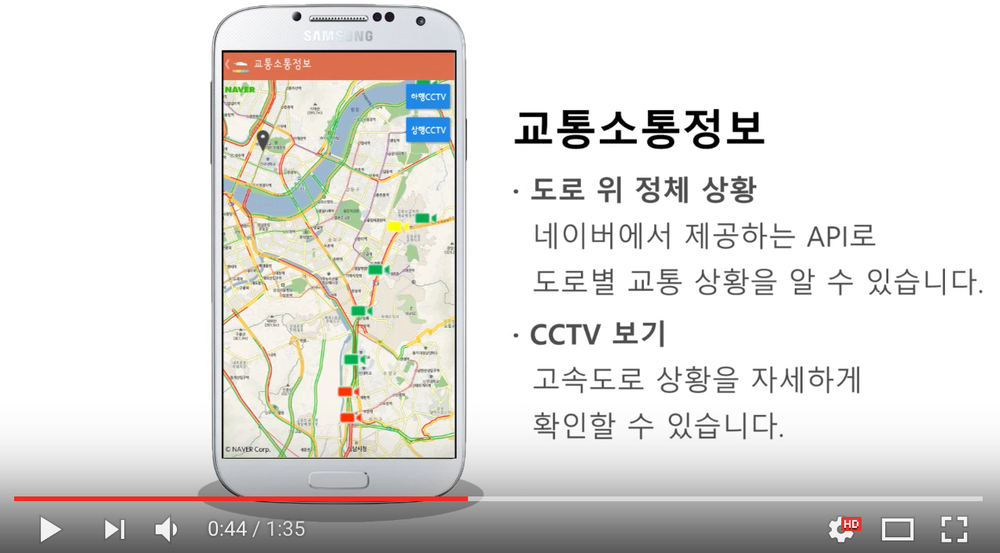

# HowLong

> 2015년 제 4회 OpenOASIS 교통데이터 활용공모전에 출전하여 진행한 프로젝트이며, 안드로이드(4.3, KitKat)과 Cyperss사 BLE 하드웨어가 결합된 IoT 프로젝트입니다.

* 개선할 점
> 처음으로 동아리 팀원들과 Android Application을 개발했던 프로젝트입니다. Code Convention 및 설계가 미숙하였습니다. 하지만, 한국도로공사, 국토교통부 API를 파싱하는 과정 및 개발하는 과정에서 개발에 흥미를 느끼게 해준 좋은 경험이었습니다! 더 열심히 하도록 하겠습니다.

### 개요
* HowLong은 고속도로 위 정체에 맞닥뜨렸을 때, 정체가 몇 킬로미터이며 몇 분후 정체를 빠져나갈 수 있는지 알려줍니다. 교통 정체 시 막연한 기다림을 해소하는데 도움을 주는 솔루션입니다.
* NAVER D2 News - http://d2.naver.com/news/8194698
* 발표 자료 - http://www.slideshare.net/SangWookNam2/en-howlong-53446480

* App 스크린샷

### 시연영상
* 동영상
 

### 개발환경 및 언어
* OS : Android 4.3, Jelly Bean
* Tools : Android Studio
* Language : JAVA SDK 8
